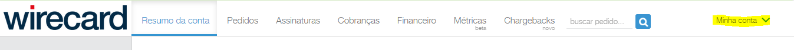
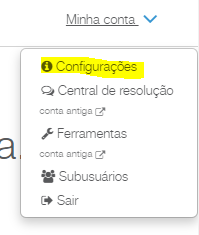
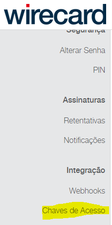
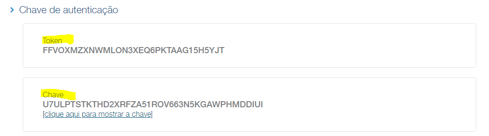
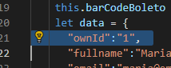
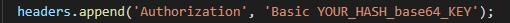
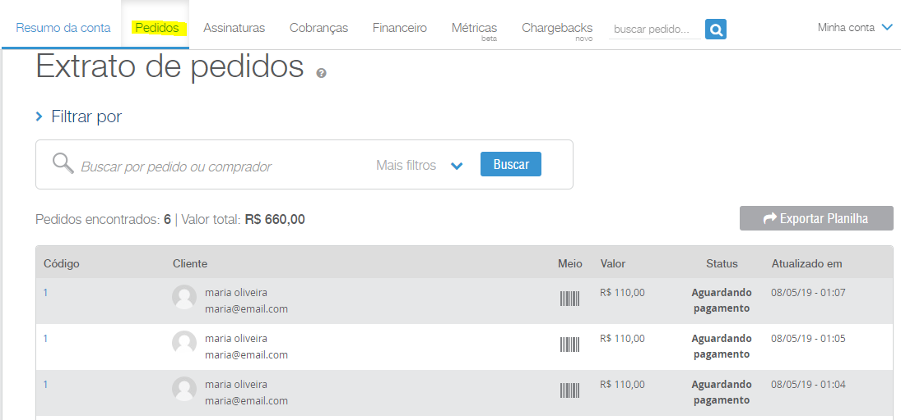

# ionic-moip-wirecard-integration
An example of Ionic integration with Moip (Wirecard) - Generate Ticket

## How to Use

* > Create a Sandbox account [here](https://bem-vindo-sandbox.wirecard.com.br/)

* > Click on "My Account":

* > Click on "Settings":

* > Click on "Access Keys":

* > Note the TOKEN and the KEY and generate a HASH base64 see the example (TOKEN:KEY), the return will be something like this: RkZWT1hNWlhOV01MT04zWEVRNlBLVEFBRzE1SDVZSlQ6VTdVTFBUU1RLVEhEMlhSRlpBNTFST1Y2NjNONUtHQVdQSE1ERElVSQ==

* > In the home.ts file, at line 21, you need to change the value of the "ownId" property to generate a new customer

* > In the api.ts file, in the createCliente(), createPedido() and createPagamento() methods, in the header, in the "Authorization" property, it is necessary to change to Basic {YOUR HASH base64 GENERATED PREVIOUSLY}

# To run:
* > npm install

* > ionic serve (run in browser)

or

* > ionic cordova run android 

or

* > ionic cordova run ios 

* > Click "Create Costumer", "Create Request", and then click "Payment"

* > A ticket will be generated and the digitable line for payment will appear on the screen

* > Returning to the Wirecard dashboard, the tickets are listed successfully

## Notes

* > You can follow step by step in the browser console.log (console inspector)

* > There are other ways to pay, this is only with Tickets
